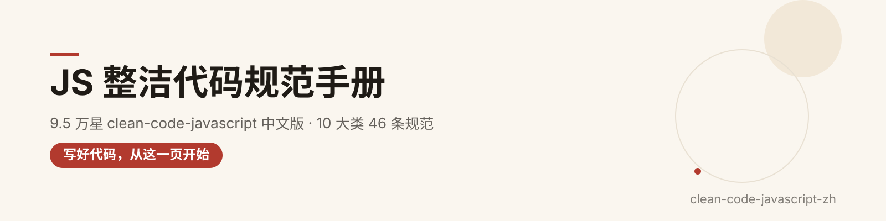
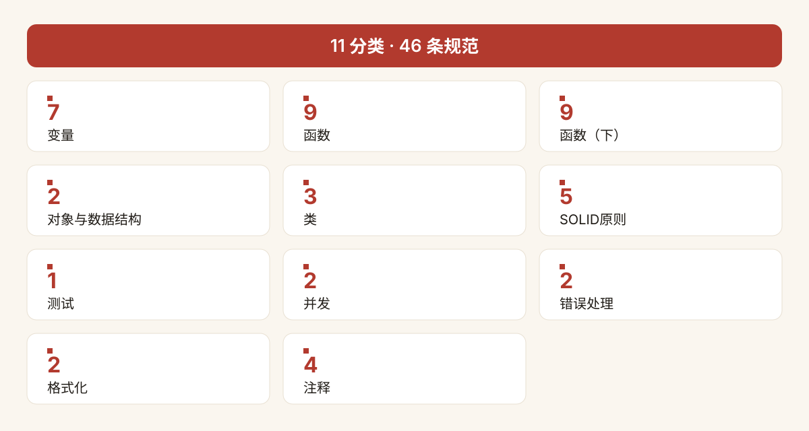
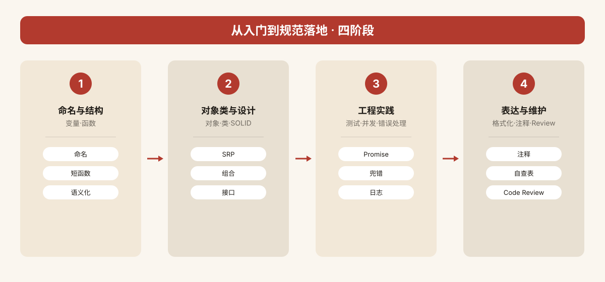

<p align="center">
  
</p>

<div align="center">


</div>

<h1 align="center">clean-code-javascript-zh</h1>

> **9.5 万 star 的「JS 整洁代码圣经」，终于有中文版了。**
>
> 从 GitHub 顶流仓库 [ryanmcdermott/clean-code-javascript](https://github.com/ryanmcdermott/clean-code-javascript)（MIT © Ryan McDermott，9.5 万 star）翻译整理成 **10 大类 46 条规范**：每条都是「中文说明 + ❌ 坏例子 + ✅ 好例子」对照，团队代码规范与新人的第一本 JS 代码修养手册。

---

⭐ 如果对你有帮助，点个 Star 支持中文开源

## ✨ 为什么值得收藏

- **10 大类 46 条规范**：变量/函数/对象/类/SOLID/测试/并发/错误处理/格式化/注释，覆盖日常写码所有场景；
- **坏/好例子对照**：每条规范都配一段「反例 vs 正例」JS 代码，一眼看懂差别；
- **中文讲解**：每条规范 1-3 句原创中文说明，讲透「为什么重要、坏在哪、怎么改」；
- **学习提示**：记忆口诀、常见违反场景、原则间关联，新人也能快速上手；
- **直接可用**：规范代码示例原样保留源项目，可直接抄进团队 ESLint 规则与 Code Review 清单。

---

## 🗂 分类总览

| # | 分类 | 条数 | # | 分类 | 条数 |
| --- | --- | --- | --- | --- | --- |
| 1. 变量 | 7 | 7. 测试 | 1 |
| 2. 函数 | 9 | 8. 并发 | 2 |
| 3. 函数（下） | 9 | 9. 错误处理 | 2 |
| 4. 对象与数据结构 | 2 | 10. 格式化 | 2 |
| 5. 类 | 3 | 11. 注释 | 4 |
| 6. SOLID 原则 | 5 |  |  |

| **合计** | **11 个分类** | **46 条规范** |  |  |  |


<p align="center">
  
</p>

---

## 🚀 怎么用这份规范

1. **团队定规范**：把 10 个分类过一遍，挑出你们最常违反的 10-15 条，写进 Code Review 检查单；
2. **新人培训**：按 01 变量 → 02/03 函数与对象 → 04/05 类与 SOLID 的顺序读，每读一条就用「坏例子 → 好例子」对照改自己的代码；
3. **日常自查**：写代码时对照「学习提示」，尤其是函数长度、副作用、命名这三类高频问题；
4. **进阶**：SOLID 五原则（05）值得反复读，是面向对象设计的骨架。

<p align="center">
  
</p>

---

## 📖 阅读约定

- 每条规范格式：**中文规范名（英文原名）** → 中文说明 → ❌ 坏例子（JS）→ ✅ 好例子（JS）→ 💡 学习提示；
- 代码示例原样保留自源项目（含英文注释），中文说明为原创翻译重述；
- 规范中的「坏/好」是约定俗成的代码风格判断，具体取舍按团队实际场景调整。

---

# 规范正文


## 1. 变量（7 条规范）

> 变量命名是代码与人沟通的第一道界面。本章围绕"名字起得对不对、能不能被搜索、读起来要不要猜"展开，帮你把命名从随手写变成团队共识。

### 使用有意义、可拼读的变量名（Use meaningful and pronounceable variable names）

变量名首先要让人一眼看懂它装的是什么，其次要能顺口读出来——因为团队讨论代码时经常需要口头交流。像 `yyyymmdstr` 这种缩写串，既读不顺，也得回头猜它到底是格式还是日期，换成 `currentDate` 就能直接表意。

❌ **坏例子**

```javascript
const yyyymmdstr = moment().format("YYYY/MM/DD");
```

✅ **好例子**

```javascript
const currentDate = moment().format("YYYY/MM/DD");
```

> 💡 学习提示：命名时先默念一遍——如果开会时你不愿意把这个词念出口，它八成不够好。

### 同一类变量使用统一词汇（Use the same vocabulary for the same type of variable）

既然都是"获取用户"，就不要在一个项目里同时出现 `getUserInfo`、`getClientData`、`getCustomerRecord` 三种写法。指代同一个概念时词汇不统一，会让读者误以为这是三种不同的数据来源，搜索和重构时也会漏改。

❌ **坏例子**

```javascript
getUserInfo();
getClientData();
getCustomerRecord();
```

✅ **好例子**

```javascript
getUser();
```

> 💡 学习提示：在团队词典里为每个核心概念选定一个词（比如统一用 user），所有函数、字段都围绕它命名。

### 使用可被搜索的名字（Use searchable names）

我们读代码的时间远多于写代码的时间，所以写下的每个名字都要能被同事用编辑器搜索到。像 `86400000` 这种裸数字散落在代码里，下次想查它含义或调整它时根本无从下手；把它提成全大写命名常量，搜索、替换、加注释都变得直接。

❌ **坏例子**

```javascript
// What the heck is 86400000 for?
setTimeout(blastOff, 86400000);
```

✅ **好例子**

```javascript
// Declare them as capitalized named constants.
const MILLISECONDS_PER_DAY = 60 * 60 * 24 * 1000; //86400000;

setTimeout(blastOff, MILLISECONDS_PER_DAY);
```

> 💡 学习提示：口诀是"魔法数字必须有名"。buddy.js、ESLint 的 no-magic-numbers 规则可以帮你揪出未命名常量。

### 使用解释性变量（Use explanatory variables）

当一段表达式里嵌套着正则匹配、数组下标取值时，不要让读者现场心算第几个捕获组对应什么。把匹配结果先解构到 `city`、`zipCode` 这样的命名变量里，后续调用一眼就能看懂，也避免重复调用 `match`。

❌ **坏例子**

```javascript
const address = "One Infinite Loop, Cupertino 95014";
const cityZipCodeRegex = /^[^,\\]+[,\\\s]+(.+?)\s*(\d{5})?$/;
saveCityZipCode(
  address.match(cityZipCodeRegex)[1],
  address.match(cityZipCodeRegex)[2]
);
```

✅ **好例子**

```javascript
const address = "One Infinite Loop, Cupertino 95014";
const cityZipCodeRegex = /^[^,\\]+[,\\\s]+(.+?)\s*(\d{5})?$/;
const [_, city, zipCode] = address.match(cityZipCodeRegex) || [];
saveCityZipCode(city, zipCode);
```

> 💡 学习提示：显式永远优于隐式。多起一个局部变量的成本，远低于读者反复回溯表达式的成本。

### 避免心照不宣的变量映射（Avoid Mental Mapping）

短到 `l`、`e`、`i` 这种单字母变量，读者必须在脑子里"翻译"它到底代表 location 还是 line。循环次数用 `i` 是惯例可以接受，但回调参数、业务对象就应该写全称，让代码不用对照上下文也能读懂。

❌ **坏例子**

```javascript
const locations = ["Austin", "New York", "San Francisco"];
locations.forEach(l => {
  doStuff();
  doSomeOtherStuff();
  // ...
  // ...
  // ...
  // Wait, what is `l` for again?
  dispatch(l);
});
```

✅ **好例子**

```javascript
const locations = ["Austin", "New York", "San Francisco"];
locations.forEach(location => {
  doStuff();
  doSomeOtherStuff();
  // ...
  // ...
  // ...
  dispatch(location);
});
```

> 💡 学习提示：单字母只留给短作用域里的循环下标；一旦作用域拉长或出现业务含义，立刻改成全称。

### 不要添加不必要的上下文（Don't add unneeded context）

如果对象本身已经叫 `Car`，它的字段就不必再写成 `carMake`、`carModel`——`car.make` 和 `make` 语义相同，前缀纯属重复。类名或对象名已经提供了上下文时，字段名要瘦下来，调用处才不会啰嗦。

❌ **坏例子**

```javascript
const Car = {
  carMake: "Honda",
  carModel: "Accord",
  carColor: "Blue"
};

function paintCar(car, color) {
  car.carColor = color;
}
```

✅ **好例子**

```javascript
const Car = {
  make: "Honda",
  model: "Accord",
  color: "Blue"
};

function paintCar(car, color) {
  car.color = color;
}
```

> 💡 学习提示：写字段前先问自己——"如果把外层对象名念出来，这个前缀还成立吗？"不成立就是冗余。

### 使用默认参数而非短路运算或条件判断（Use default parameters instead of short circuiting or conditionals）

`name || "默认值"` 这种短路写法看似省事，但它会把空字符串、`0`、`false` 这些"合法的假值"也一并替换掉，暗藏 bug。ES6 的默认参数只在参数为 `undefined` 时才生效，语义更精确，也把默认值直接写进了函数签名。

❌ **坏例子**

```javascript
function createMicrobrewery(name) {
  const breweryName = name || "Hipster Brew Co.";
  // ...
}
```

✅ **好例子**

```javascript
function createMicrobrewery(name = "Hipster Brew Co.") {
  // ...
}
```

> 💡 学习提示：记住默认参数只认 `undefined`，不认 `''`、`0`、`false`、`null`、`NaN`——这正是它比 `||` 安全的原因。

## 2. 函数（9 条规范）

> 函数是程序执行的基本单元。本章从参数数量、单一职责、命名、抽象层次、去重、默认配置、标志位到副作用，层层拆解"什么样的函数才值得被测试和被复用"。

### 函数参数（理想情况下不超过 2 个）（Function arguments (2 or fewer ideally)）

参数越多，测试要覆盖的组合就爆炸式增长。一两个参数最理想，三个就该警惕，再多通常说明函数承担了过多职责。JavaScript 可以随手构造对象，参数一多就用一个配置对象收拢；配合 ES6 解构，签名上一眼能看到用到哪些字段，还能模拟命名参数、让 lint 帮你发现未使用项。

❌ **坏例子**

```javascript
function createMenu(title, body, buttonText, cancellable) {
  // ...
}

createMenu("Foo", "Bar", "Baz", true);

```

✅ **好例子**

```javascript
function createMenu({ title, body, buttonText, cancellable }) {
  // ...
}

createMenu({
  title: "Foo",
  body: "Bar",
  buttonText: "Baz",
  cancellable: true
});
```

> 💡 学习提示：看到 3 个以上参数先别急着写函数签名，问自己一句"这是不是该用对象包起来了？"

### 函数应当只做一件事（Functions should do one thing）

这是软件工程里分量最重的一条。当一个函数既筛选活跃用户、又查库、又发邮件时，它就难以组合、难以测试、难以讲清楚。把"判断是否活跃"拆成独立函数后，主函数读起来像一行业务陈述，每个零件也能单独复用。

❌ **坏例子**

```javascript
function emailClients(clients) {
  clients.forEach(client => {
    const clientRecord = database.lookup(client);
    if (clientRecord.isActive()) {
      email(client);
    }
  });
}
```

✅ **好例子**

```javascript
function emailActiveClients(clients) {
  clients.filter(isActiveClient).forEach(email);
}

function isActiveClient(client) {
  const clientRecord = database.lookup(client);
  return clientRecord.isActive();
}
```

> 💡 学习提示：自检方法——函数名里如果出现"和""并""然后"，往往就已经在做两件事了。

### 函数名应能说明它做什么（Function names should say what they do）

`addToDate(date, 1)` 这种名字让人猜：到底加的是天、月还是年？函数名必须把动作和对象讲清楚，调用处不用翻函数体就能知道发生了什么。好名字能让调用代码读起来像一句完整的话。

❌ **坏例子**

```javascript
function addToDate(date, month) {
  // ...
}

const date = new Date();

// It's hard to tell from the function name what is added
addToDate(date, 1);
```

✅ **好例子**

```javascript
function addMonthToDate(month, date) {
  // ...
}

const date = new Date();
addMonthToDate(1, date);
```

> 💡 学习提示：命名动词要精确（addMonthToDate 而不是 addToDate），参数顺序也顺手调整成"被加的量在前、作用对象在后"。

### 函数只应保持一个抽象层次（Functions should only be one level of abstraction）

一个函数里如果同时出现正则拆分、词法分析、语法树遍历这种不同粒度的步骤，读者就要不断在高层语义和底层细节之间来回切换。正确做法是把每个层次拆成独立函数，主函数只做"调度"，读起来就是一份清晰的大纲。

❌ **坏例子**

```javascript
function parseBetterJSAlternative(code) {
  const REGEXES = [
    // ...
  ];

  const statements = code.split(" ");
  const tokens = [];
  REGEXES.forEach(REGEX => {
    statements.forEach(statement => {
      // ...
    });
  });

  const ast = [];
  tokens.forEach(token => {
    // lex...
  });

  ast.forEach(node => {
    // parse...
  });
}
```

✅ **好例子**

```javascript
function parseBetterJSAlternative(code) {
  const tokens = tokenize(code);
  const syntaxTree = parse(tokens);
  syntaxTree.forEach(node => {
    // parse...
  });
}

function tokenize(code) {
  const REGEXES = [
    // ...
  ];

  const statements = code.split(" ");
  const tokens = [];
  REGEXES.forEach(REGEX => {
    statements.forEach(statement => {
      tokens.push(/* ... */);
    });
  });

  return tokens;
}

function parse(tokens) {
  const syntaxTree = [];
  tokens.forEach(token => {
    syntaxTree.push(/* ... */);
  });

  return syntaxTree;
}
```

> 💡 学习提示：和上一条"只做一件事"互为表里——拆出来的每个子函数本身也应该只在一个抽象层上活动。

### 消除重复代码（Remove duplicate code）

重复代码意味着同一处逻辑散落在多个地方，下次改需求就得满世界找、漏改一处就是 bug。开发者和经理列表看起来差一点点，但大部分逻辑相同——把公共部分抽到一个函数，差异点用分支处理。不过要小心：糟糕的抽象比重复代码更难维护，抽象的分寸要靠 SOLID 原则来把握。

❌ **坏例子**

```javascript
function showDeveloperList(developers) {
  developers.forEach(developer => {
    const expectedSalary = developer.calculateExpectedSalary();
    const experience = developer.getExperience();
    const githubLink = developer.getGithubLink();
    const data = {
      expectedSalary,
      experience,
      githubLink
    };

    render(data);
  });
}

function showManagerList(managers) {
  managers.forEach(manager => {
    const expectedSalary = manager.calculateExpectedSalary();
    const experience = manager.getExperience();
    const portfolio = manager.getMBAProjects();
    const data = {
      expectedSalary,
      experience,
      portfolio
    };

    render(data);
  });
}
```

✅ **好例子**

```javascript
function showEmployeeList(employees) {
  employees.forEach(employee => {
    const expectedSalary = employee.calculateExpectedSalary();
    const experience = employee.getExperience();

    const data = {
      expectedSalary,
      experience
    };

    switch (employee.type) {
      case "manager":
        data.portfolio = employee.getMBAProjects();
        break;
      case "developer":
        data.githubLink = employee.getGithubLink();
        break;
    }

    render(data);
  });
}
```

> 💡 学习提示：DRY（Don't Repeat Yourself）不是"凡是像就抽"，而是先识别变化点，再把不变的部分收拢。

### 用 Object.assign 设置默认对象（Set default objects with Object.assign）

逐个属性写 `config.title = config.title || "Foo"` 又啰嗦又会污染入参对象。用 `Object.assign(默认对象, 用户配置)` 把默认值和传入配置合并成一个新对象，默认值集中在一处声明，调用方没传的字段自动补齐，还不会改写原始 config。

❌ **坏例子**

```javascript
const menuConfig = {
  title: null,
  body: "Bar",
  buttonText: null,
  cancellable: true
};

function createMenu(config) {
  config.title = config.title || "Foo";
  config.body = config.body || "Bar";
  config.buttonText = config.buttonText || "Baz";
  config.cancellable =
    config.cancellable !== undefined ? config.cancellable : true;
}

createMenu(menuConfig);
```

✅ **好例子**

```javascript
const menuConfig = {
  title: "Order",
  // User did not include 'body' key
  buttonText: "Send",
  cancellable: true
};

function createMenu(config) {
  let finalConfig = Object.assign(
    {
      title: "Foo",
      body: "Bar",
      buttonText: "Baz",
      cancellable: true
    },
    config
  );
  return finalConfig
  // config now equals: {title: "Order", body: "Bar", buttonText: "Send", cancellable: true}
  // ...
}

createMenu(menuConfig);
```

> 💡 学习提示：这是"函数参数不超过 2 个"里配置对象模式的标配——默认值放第一个参数，用户配置放第二个。

### 不要把标志位当作函数参数（Don't use flags as function parameters）

一个布尔参数往往在告诉调用方："我里面根据这个值走了两条完全不同的路"——这等于一个函数干了两件事。与其让 `createFile(name, true/false)` 分叉，不如拆成 `createFile` 和 `createTempFile` 两个函数，调用处名字自解释，也免去了阅读 `if (temp)`。

❌ **坏例子**

```javascript
function createFile(name, temp) {
  if (temp) {
    fs.create(`./temp/${name}`);
  } else {
    fs.create(name);
  }
}
```

✅ **好例子**

```javascript
function createFile(name) {
  fs.create(name);
}

function createTempFile(name) {
  createFile(`./temp/${name}`);
}
```

> 💡 学习提示：和"函数只做一件事"是亲兄弟——看到布尔参数分叉，第一反应就是拆函数。

### 避免副作用（上）（Avoid Side Effects (part 1)）

函数除了"收一个值、吐一个值"之外，只要还改动了外部世界——写文件、改全局变量、改共享状态——就产生了副作用。完全禁止副作用不现实（程序总得和外部打交道），但要把它们集中到一处，别让多个函数偷偷改同一个全局变量。把全局变量改成函数参数和返回值，调用方的状态就不再被偷偷改写。

❌ **坏例子**

```javascript
// Global variable referenced by following function.
// If we had another function that used this name, now it'd be an array and it could break it.
let name = "Ryan McDermott";

function splitIntoFirstAndLastName() {
  name = name.split(" ");
}

splitIntoFirstAndLastName();

console.log(name); // ['Ryan', 'McDermott'];
```

✅ **好例子**

```javascript
function splitIntoFirstAndLastName(name) {
  return name.split(" ");
}

const name = "Ryan McDermott";
const newName = splitIntoFirstAndLastName(name);

console.log(name); // 'Ryan McDermott';
console.log(newName); // ['Ryan', 'McDermott'];
```

> 💡 学习提示：本节针对的是"偷偷改全局/共享变量"；下一节继续讲"改传入的对象/数组"这个更隐蔽的副作用。

### 避免副作用（下）（Avoid Side Effects (part 2)）

JavaScript 里对象和数组是引用传递，函数一改，所有持有同一引用的地方都会受影响。购物车场景最典型：下单请求还在重试，用户又点了一次加购，`cart` 被原地 push，请求就把误加的商品也发了出去。解法是函数内克隆一份再修改、返回新数组，老引用纹丝不动。真正必须修改入参的场景很少，而克隆大对象的性能问题已有 Immutable.js 之类的库兜底。

❌ **坏例子**

```javascript
const addItemToCart = (cart, item) => {
  cart.push({ item, date: Date.now() });
};
```

✅ **好例子**

```javascript
const addItemToCart = (cart, item) => {
  return [...cart, { item, date: Date.now() }];
};
```

> 💡 学习提示：口诀——"入参只读，返回新值"。展开运算符 `[...arr, x]` 和 `{...obj, k: v}` 就是最轻量的克隆手段。

## 3. 函数（下）（9 条规范）

> 承接「函数（上）」，这一部分继续打磨函数的边界与表达方式：从不污染全局、改用函数式风格，到条件判断的封装与消除，再到类型检查、性能优化与死代码清理，目标是让函数既稳定又易读。

### 不要扩展全局函数原型（Don't write to global functions）

往全局对象（如 `Array.prototype`）上直接挂自定义方法看似省事，实则极易和第三方库撞名，而这种冲突往往要等到线上抛异常才会暴露。更稳妥的做法是用 ES6 类继承原生类型，在自己的子类里扩展方法，彼此井水不犯河水。

❌ **坏例子**

```javascript
Array.prototype.diff = function diff(comparisonArray) {
  const hash = new Set(comparisonArray);
  return this.filter(elem => !hash.has(elem));
};
```

✅ **好例子**

```javascript
class SuperArray extends Array {
  diff(comparisonArray) {
    const hash = new Set(comparisonArray);
    return this.filter(elem => !hash.has(elem));
  }
}
```

> 💡 学习提示：原型污染是前端历史上反复踩坑的重灾区——扩展原生原型之前，先想想“别人也可能用同一个名字”。

### 优先函数式编程（Favor functional programming over imperative programming）

JavaScript 虽不是 Haskell 那样的纯函数式语言，但天生带着函数式味道：`map`/`filter`/`reduce` 这类高阶函数让代码更声明式、更好测试。能用函数式风格表达时，就别再手写带可变计数器的 for 循环。

❌ **坏例子**

```javascript
const programmerOutput = [
  {
    name: "Uncle Bobby",
    linesOfCode: 500
  },
  {
    name: "Suzie Q",
    linesOfCode: 1500
  },
  {
    name: "Jimmy Gosling",
    linesOfCode: 150
  },
  {
    name: "Gracie Hopper",
    linesOfCode: 1000
  }
];

let totalOutput = 0;

for (let i = 0; i < programmerOutput.length; i++) {
  totalOutput += programmerOutput[i].linesOfCode;
}
```

✅ **好例子**

```javascript
const programmerOutput = [
  {
    name: "Uncle Bobby",
    linesOfCode: 500
  },
  {
    name: "Suzie Q",
    linesOfCode: 1500
  },
  {
    name: "Jimmy Gosling",
    linesOfCode: 150
  },
  {
    name: "Gracie Hopper",
    linesOfCode: 1000
  }
];

const totalOutput = programmerOutput.reduce(
  (totalLines, output) => totalLines + output.linesOfCode,
  0
);
```

> 💡 学习提示：`reduce` 的第二个参数（这里的初值 `0`）千万别漏，否则空数组会直接抛错。

### 把条件判断封装成函数（Encapsulate conditionals）

把一长串布尔表达式直接塞进 `if`，读代码的人得当场停下来拆解“这到底在判断什么”。把判断抽成一个见名知意的函数，调用处的语义立刻一目了然。

❌ **坏例子**

```javascript
if (fsm.state === "fetching" && isEmpty(listNode)) {
  // ...
}
```

✅ **好例子**

```javascript
function shouldShowSpinner(fsm, listNode) {
  return fsm.state === "fetching" && isEmpty(listNode);
}

if (shouldShowSpinner(fsmInstance, listNodeInstance)) {
  // ...
}
```

> 💡 学习提示：好函数名就是最好的注释——`shouldShowSpinner` 本身就说清了这段条件的业务含义。

### 避免否定条件（Avoid negative conditionals）

双重否定会额外消耗读者的脑力。把 `isNotXxx` 这类函数改写成肯定形式，调用处的 `if` 也能顺势去掉一个感叹号，读起来顺得多。

❌ **坏例子**

```javascript
function isDOMNodeNotPresent(node) {
  // ...
}

if (!isDOMNodeNotPresent(node)) {
  // ...
}
```

✅ **好例子**

```javascript
function isDOMNodePresent(node) {
  // ...
}

if (isDOMNodePresent(node)) {
  // ...
}
```

> 💡 学习提示：写完条件判断后反问自己一句——“这个判断能不能从正面描述？”

### 尽量消除条件语句（Avoid conditionals）

“不用 `if` 还怎么写代码？”答案是多态。当一个函数靠 `switch`/`if` 按类型分派做不同的事，往往意味着它承担了多个职责；把每种分支拆成独立子类、各自实现同一个方法，调用方就无需再关心具体类型。

❌ **坏例子**

```javascript
class Airplane {
  // ...
  getCruisingAltitude() {
    switch (this.type) {
      case "777":
        return this.getMaxAltitude() - this.getPassengerCount();
      case "Air Force One":
        return this.getMaxAltitude();
      case "Cessna":
        return this.getMaxAltitude() - this.getFuelExpenditure();
    }
  }
}
```

✅ **好例子**

```javascript
class Airplane {
  // ...
}

class Boeing777 extends Airplane {
  // ...
  getCruisingAltitude() {
    return this.getMaxAltitude() - this.getPassengerCount();
  }
}

class AirForceOne extends Airplane {
  // ...
  getCruisingAltitude() {
    return this.getMaxAltitude();
  }
}

class Cessna extends Airplane {
  // ...
  getCruisingAltitude() {
    return this.getMaxAltitude() - this.getFuelExpenditure();
  }
}
```

> 💡 学习提示：这条不是禁止所有 `if`，而是警惕“按类型分派”的大段分支；普通的判空、容错逻辑仍然合理。

### 避免手动类型检查（上）（Avoid type-checking (part 1)）

JS 是动态类型语言，函数里用 `instanceof` 逐个分支判断入参类型，往往说明接口设计不统一。更好的做法是约定一个统一方法名（如 `move`），让不同类型各自实现，调用方一视同仁。

❌ **坏例子**

```javascript
function travelToTexas(vehicle) {
  if (vehicle instanceof Bicycle) {
    vehicle.pedal(this.currentLocation, new Location("texas"));
  } else if (vehicle instanceof Car) {
    vehicle.drive(this.currentLocation, new Location("texas"));
  }
}
```

✅ **好例子**

```javascript
function travelToTexas(vehicle) {
  vehicle.move(this.currentLocation, new Location("texas"));
}
```

> 💡 学习提示：统一 API 就是“面向接口编程”在鸭子类型世界里的落地方式。

### 避免手动类型检查（下）（Avoid type-checking (part 2)）

当参数是字符串、数字这类基本类型、无法靠多态解决时，与其在运行时写一堆 `typeof` 判断和抛错，不如直接上 TypeScript 拿静态类型。手写的“伪类型安全”往往啰嗦得得不偿失，反倒牺牲了可读性。

❌ **坏例子**

```javascript
function combine(val1, val2) {
  if (
    (typeof val1 === "number" && typeof val2 === "number") ||
    (typeof val1 === "string" && typeof val2 === "string")
  ) {
    return val1 + val2;
  }

  throw new Error("Must be of type String or Number");
}
```

✅ **好例子**

```javascript
function combine(val1, val2) {
  return val1 + val2;
}
```

> 💡 学习提示：如果项目暂时只能用纯 JS，就把精力放在好测试和 Code Review 上，而不是堆运行时类型断言。

### 不要过度优化（Don't over-optimize）

现代浏览器在运行时已经自动做了大量优化，很多“经典优化技巧”在今天纯属白费功夫。先把代码写清晰，只有经过性能分析确认是瓶颈的地方，再去针对性优化。

❌ **坏例子**

```javascript
// On old browsers, each iteration with uncached `list.length` would be costly
// because of `list.length` recomputation. In modern browsers, this is optimized.
for (let i = 0, len = list.length; i < len; i++) {
  // ...
}
```

✅ **好例子**

```javascript
for (let i = 0; i < list.length; i++) {
  // ...
}
```

> 💡 学习提示：以今天的 JS 引擎，缓存 `list.length` 这类老技巧早已是自动行为，别为二十年前的经验牺牲可读性。

### 删除死代码（Remove dead code）

不再被调用的代码和重复代码一样有害，留在仓库里只会增加阅读负担。放心删掉——版本控制历史里永远找得回来。

❌ **坏例子**

```javascript
function oldRequestModule(url) {
  // ...
}

function newRequestModule(url) {
  // ...
}

const req = newRequestModule;
inventoryTracker("apples", req, "www.inventory-awesome.io");
```

✅ **好例子**

```javascript
function newRequestModule(url) {
  // ...
}

const req = newRequestModule;
inventoryTracker("apples", req, "www.inventory-awesome.io");
```

> 💡 学习提示：靠注释掉的旧代码“存档”是坏习惯，Git 历史才是真正的存档处。

## 4. 对象与数据结构（2 条规范）

> 对象不该是裸露的数据袋。这一部分只讲两件事：如何用 getter/setter 给属性访问加一层受控的壳，以及如何用闭包把内部成员真正藏起来，让外部无法随意篡改。

### 使用 getter 和 setter（Use getters and setters）

直接读写对象属性看似简单，但一旦将来要加校验、打日志或改成从服务器惰性加载，就得改动代码库里每一处访问点。通过 getter/setter 封装后，这些横切逻辑只需在一处实现，外面的调用代码保持原样。

❌ **坏例子**

```javascript
function makeBankAccount() {
  // ...

  return {
    balance: 0
    // ...
  };
}

const account = makeBankAccount();
account.balance = 100;
```

✅ **好例子**

```javascript
function makeBankAccount() {
  // this one is private
  let balance = 0;

  // a "getter", made public via the returned object below
  function getBalance() {
    return balance;
  }

  // a "setter", made public via the returned object below
  function setBalance(amount) {
    // ... validate before updating the balance
    balance = amount;
  }

  return {
    // ...
    getBalance,
    setBalance
  };
}

const account = makeBankAccount();
account.setBalance(100);
```

> 💡 学习提示：今天更推荐用 ES6 class 的 `get`/`set` 语法糖，思路等价、写法更现代。

### 让对象拥有私有成员（Make objects have private members）

把数据挂在 `this` 上其实是公开的，外部一句 `delete` 就能删掉，直接破坏对象状态。借助闭包——把变量封在工厂函数内部、只暴露访问方法——才能做到外部真正摸不到。

❌ **坏例子**

```javascript
const Employee = function(name) {
  this.name = name;
};

Employee.prototype.getName = function getName() {
  return this.name;
};

const employee = new Employee("John Doe");
console.log(`Employee name: ${employee.getName()}`); // Employee name: John Doe
delete employee.name;
console.log(`Employee name: ${employee.getName()}`); // Employee name: undefined
```

✅ **好例子**

```javascript
function makeEmployee(name) {
  return {
    getName() {
      return name;
    }
  };
}

const employee = makeEmployee("John Doe");
console.log(`Employee name: ${employee.getName()}`); // Employee name: John Doe
delete employee.name;
console.log(`Employee name: ${employee.getName()}`); // Employee name: John Doe
```

> 💡 学习提示：ES6 class 的 `#` 私有字段是同一思路的语法糖，现在写新项目可以直接用它代替闭包。

## 5. 类（3 条规范）

> 类是把数据和行为打包在一起的手段，但"用不用类、怎么继承、怎么组织方法"直接决定代码的可读性与可扩展性。本章给出 3 条关于类的书写约定。

### 优先使用 ES2015/ES6 类而非 ES5 普通函数（Prefer ES2015/ES6 classes over ES5 plain functions）

ES5 时代要手写继承：构造函数里判断 `this instanceof`、用 `Animal.call(this, age)` 借调父类构造、再用 `Object.create` 接上原型链、回头修 `constructor`，一步都不能少，啰嗦又容易写错。ES6 的 `class` / `extends` / `super` 把这些机制收进了语法糖，继承关系一眼可读。不过也要克制：能用小函数解决的就别急着上类，只有当对象确实变大、变复杂时再引入类。

❌ **坏例子**

```javascript
const Animal = function(age) {
  if (!(this instanceof Animal)) {
    throw new Error("Instantiate Animal with `new`");
  }

  this.age = age;
};

Animal.prototype.move = function move() {};

const Mammal = function(age, furColor) {
  if (!(this instanceof Mammal)) {
    throw new Error("Instantiate Mammal with `new`");
  }

  Animal.call(this, age);
  this.furColor = furColor;
};

Mammal.prototype = Object.create(Animal.prototype);
Mammal.prototype.constructor = Mammal;
Mammal.prototype.liveBirth = function liveBirth() {};

const Human = function(age, furColor, languageSpoken) {
  if (!(this instanceof Human)) {
    throw new Error("Instantiate Human with `new`");
  }

  Mammal.call(this, age, furColor);
  this.languageSpoken = languageSpoken;
};

Human.prototype = Object.create(Mammal.prototype);
Human.prototype.constructor = Human;
Human.prototype.speak = function speak() {};
```

✅ **好例子**

```javascript
class Animal {
  constructor(age) {
    this.age = age;
  }

  move() {
    /* ... */
  }
}

class Mammal extends Animal {
  constructor(age, furColor) {
    super(age);
    this.furColor = furColor;
  }

  liveBirth() {
    /* ... */
  }
}

class Human extends Mammal {
  constructor(age, furColor, languageSpoken) {
    super(age, furColor);
    this.languageSpoken = languageSpoken;
  }

  speak() {
    /* ... */
  }
}
```

> 💡 学习提示：看到一堆 `prototype = Object.create(...)` 加 `constructor = ...` 的样板代码，就是在提醒你——该换成 ES6 class 了；但反过来，"能写 class"不等于"该写 class"，先问自己是不是真需要一个对象。

### 使用方法链式调用（Use method chaining）

在类的每个 setter / 操作方法末尾 `return this`，调用方就能把一连串方法像搭积木一样串在同一行里。jQuery、Lodash 都是靠这个让代码显得短小而达意。落地很简单：除了真正要返回数据的查询方法，其余修改自身状态的方法一律 `return this`。

❌ **坏例子**

```javascript
class Car {
  constructor(make, model, color) {
    this.make = make;
    this.model = model;
    this.color = color;
  }

  setMake(make) {
    this.make = make;
  }

  setModel(model) {
    this.model = model;
  }

  setColor(color) {
    this.color = color;
  }

  save() {
    console.log(this.make, this.model, this.color);
  }
}

const car = new Car("Ford", "F-150", "red");
car.setColor("pink");
car.save();
```

✅ **好例子**

```javascript
class Car {
  constructor(make, model, color) {
    this.make = make;
    this.model = model;
    this.color = color;
  }

  setMake(make) {
    this.make = make;
    // NOTE: Returning this for chaining
    return this;
  }

  setModel(model) {
    this.model = model;
    // NOTE: Returning this for chaining
    return this;
  }

  setColor(color) {
    this.color = color;
    // NOTE: Returning this for chaining
    return this;
  }

  save() {
    console.log(this.make, this.model, this.color);
    // NOTE: Returning this for chaining
    return this;
  }
}

const car = new Car("Ford", "F-150", "red").setColor("pink").save();
```

> 💡 学习提示：链式调用是"语法糖"而非"银弹"——它适合配置、构建这类对同一对象连续下指令的场景；如果一个方法需要返回有意义的数据，就别硬凑 `return this`。

### 组合优于继承（Prefer composition over inheritance）

四人帮《设计模式》的经典建议：能组合就别急着继承。继承真正合适的场景有限——两者是真"is-a"（人是动物）、要复用基类实现、想通过改基类统一影响所有子类。而当两个类只是"has-a"（员工"有"税务资料）时，让员工持有一个税务对象的实例，比让税务资料去继承员工要灵活得多，也不会被继承层级绑死。

❌ **坏例子**

```javascript
class Employee {
  constructor(name, email) {
    this.name = name;
    this.email = email;
  }

  // ...
}

// Bad because Employees "have" tax data. EmployeeTaxData is not a type of Employee
class EmployeeTaxData extends Employee {
  constructor(ssn, salary) {
    super();
    this.ssn = ssn;
    this.salary = salary;
  }

  // ...
}
```

✅ **好例子**

```javascript
class EmployeeTaxData {
  constructor(ssn, salary) {
    this.ssn = ssn;
    this.salary = salary;
  }

  // ...
}

class Employee {
  constructor(name, email) {
    this.name = name;
    this.email = email;
  }

  setTaxData(ssn, salary) {
    this.taxData = new EmployeeTaxData(ssn, salary);
  }
  // ...
}
```

> 💡 学习提示：判断该用继承还是组合，先在心里默念一句"X 是一个 Y"。读得通（正方形是一种形状）再考虑继承；读不通（税务资料是一种员工？）就果断改成组合持有。

## 6. SOLID 原则（5 条规范）

> SOLID 是面向对象设计的五条核心原则，缩写自 SRP / OCP / LSP / ISP / DIP。它们共同回答一个问题：怎么把类切小、切对，让代码好扩展、好替换、好维护。本章逐条给出可落地的判断标准。

### 单一职责原则（Single Responsibility Principle，SRP）

《Clean Code》里那句话："一个类存在的修改理由不应该超过一个。"给一个类塞太多功能，就像出差只带一个行李箱——全塞进去后概念上不再内聚，改任何一处都可能波及其它依赖模块。落地方法：按"变更原因"拆类，认证归认证、设置归设置，类之间通过组合协作。

❌ **坏例子**

```javascript
class UserSettings {
  constructor(user) {
    this.user = user;
  }

  changeSettings(settings) {
    if (this.verifyCredentials()) {
      // ...
    }
  }

  verifyCredentials() {
    // ...
  }
}
```

✅ **好例子**

```javascript
class UserAuth {
  constructor(user) {
    this.user = user;
  }

  verifyCredentials() {
    // ...
  }
}

class UserSettings {
  constructor(user) {
    this.user = user;
    this.auth = new UserAuth(user);
  }

  changeSettings(settings) {
    if (this.auth.verifyCredentials()) {
      // ...
    }
  }
}
```

> 💡 学习提示：问自己"这个类为什么要改？"——如果答案能列出两三个互不相关的理由（改字段校验、改登录逻辑、改存储方式），就说明该拆了。

### 开闭原则（Open/Closed Principle，OCP）

Bertrand Meyer 提出："软件实体应对扩展开放，对修改关闭。"意思是加新功能时应该是新增代码（新类、新实现），而不是回头去改老代码里的 `if/else` 分支。落地手段是面向抽象编程：让依赖方只认抽象约定，具体实现各写各的，新增一种适配器就新增一个类。

❌ **坏例子**

```javascript
class AjaxAdapter extends Adapter {
  constructor() {
    super();
    this.name = "ajaxAdapter";
  }
}

class NodeAdapter extends Adapter {
  constructor() {
    super();
    this.name = "nodeAdapter";
  }
}

class HttpRequester {
  constructor(adapter) {
    this.adapter = adapter;
  }

  fetch(url) {
    if (this.adapter.name === "ajaxAdapter") {
      return makeAjaxCall(url).then(response => {
        // transform response and return
      });
    } else if (this.adapter.name === "nodeAdapter") {
      return makeHttpCall(url).then(response => {
        // transform response and return
      });
    }
  }
}

function makeAjaxCall(url) {
  // request and return promise
}

function makeHttpCall(url) {
  // request and return promise
}
```

✅ **好例子**

```javascript
class AjaxAdapter extends Adapter {
  constructor() {
    super();
    this.name = "ajaxAdapter";
  }

  request(url) {
    // request and return promise
  }
}

class NodeAdapter extends Adapter {
  constructor() {
    super();
    this.name = "nodeAdapter";
  }

  request(url) {
    // request and return promise
  }
}

class HttpRequester {
  constructor(adapter) {
    this.adapter = adapter;
  }

  fetch(url) {
    return this.adapter.request(url).then(response => {
      // transform response and return
    });
  }
}
```

> 💡 学习提示：一旦在业务代码里看到 `if (xxx.name === "A") ... else if (xxx.name === "B")` 这种按类型分支，多半就是 OCP 在报警——把分支收进每个实现类自己的 `request` 方法里。

### 里氏替换原则（Liskov Substitution Principle，LSP）

名字吓人，意思很朴素：子类必须能在父类出现的任何地方原样替换，而不破坏程序的正确性。经典反例是"正方形继承长方形"——数学上正方形是长方形，但一旦让 `Square extends Rectangle`，`setWidth` / `setHeight` 就得互相牵连，外部按长方形的用法调用就会算出错误面积。正确做法是让两者共同继承一个更抽象的 `Shape`。

❌ **坏例子**

```javascript
class Rectangle {
  constructor() {
    this.width = 0;
    this.height = 0;
  }

  setColor(color) {
    // ...
  }

  render(area) {
    // ...
  }

  setWidth(width) {
    this.width = width;
  }

  setHeight(height) {
    this.height = height;
  }

  getArea() {
    return this.width * this.height;
  }
}

class Square extends Rectangle {
  setWidth(width) {
    this.width = width;
    this.height = width;
  }

  setHeight(height) {
    this.width = height;
    this.height = height;
  }
}

function renderLargeRectangles(rectangles) {
  rectangles.forEach(rectangle => {
    rectangle.setWidth(4);
    rectangle.setHeight(5);
    const area = rectangle.getArea(); // BAD: Returns 25 for Square. Should be 20.
    rectangle.render(area);
  });
}

const rectangles = [new Rectangle(), new Rectangle(), new Square()];
renderLargeRectangles(rectangles);
```

✅ **好例子**

```javascript
class Shape {
  setColor(color) {
    // ...
  }

  render(area) {
    // ...
  }
}

class Rectangle extends Shape {
  constructor(width, height) {
    super();
    this.width = width;
    this.height = height;
  }

  getArea() {
    return this.width * this.height;
  }
}

class Square extends Shape {
  constructor(length) {
    super();
    this.length = length;
  }

  getArea() {
    return this.length * this.length;
  }
}

function renderLargeShapes(shapes) {
  shapes.forEach(shape => {
    const area = shape.getArea();
    shape.render(area);
  });
}

const shapes = [new Rectangle(4, 5), new Rectangle(4, 5), new Square(5)];
renderLargeShapes(shapes);
```

> 💡 学习提示：子类方法的行为契约必须"不弱于"父类——可以强化前置条件，但不能削弱后置条件。否则一旦把子类塞回父类列表里跑，结果就会悄悄出错。

### 接口隔离原则（Interface Segregation Principle，ISP）

"不应该强迫客户端依赖它用不到的方法。"JS 没有显式接口，但鸭子类型下接口是隐式约定。典型场景是大而全的配置对象：调用方明明只想遍历 DOM，却被迫要传一个动画模块进来。把配置拆细、把可选项做成"需要才配置"，就能避免肥大接口。

❌ **坏例子**

```javascript
class DOMTraverser {
  constructor(settings) {
    this.settings = settings;
    this.setup();
  }

  setup() {
    this.rootNode = this.settings.rootNode;
    this.settings.animationModule.setup();
  }

  traverse() {
    // ...
  }
}

const $ = new DOMTraverser({
  rootNode: document.getElementsByTagName("body"),
  animationModule() {} // Most of the time, we won't need to animate when traversing.
  // ...
});
```

✅ **好例子**

```javascript
class DOMTraverser {
  constructor(settings) {
    this.settings = settings;
    this.options = settings.options;
    this.setup();
  }

  setup() {
    this.rootNode = this.settings.rootNode;
    this.setupOptions();
  }

  setupOptions() {
    if (this.options.animationModule) {
      // ...
    }
  }

  traverse() {
    // ...
  }
}

const $ = new DOMTraverser({
  rootNode: document.getElementsByTagName("body"),
  options: {
    animationModule() {}
  }
});
```

> 💡 学习提示：看构造函数要的参数列表——如果客户端经常要传 `undefined` 或空函数占位，说明接口太胖，该按使用场景拆成多个小配置。

### 依赖倒置原则（Dependency Inversion Principle，DIP）

两句话：高层模块不该依赖低层模块，二者都该依赖抽象；抽象不该依赖细节，细节该依赖抽象。落到 JS 里就是——别在类内部 `new` 具体实现，而是把实现作为参数从外面注入进来（依赖注入）。这样换一种请求方式（HTTP 换 WebSocket）只需在外部换一个实例，业务代码一行都不用改。

❌ **坏例子**

```javascript
class InventoryRequester {
  constructor() {
    this.REQ_METHODS = ["HTTP"];
  }

  requestItem(item) {
    // ...
  }
}

class InventoryTracker {
  constructor(items) {
    this.items = items;

    // BAD: We have created a dependency on a specific request implementation.
    // We should just have requestItems depend on a request method: `request`
    this.requester = new InventoryRequester();
  }

  requestItems() {
    this.items.forEach(item => {
      this.requester.requestItem(item);
    });
  }
}

const inventoryTracker = new InventoryTracker(["apples", "bananas"]);
inventoryTracker.requestItems();
```

✅ **好例子**

```javascript
class InventoryTracker {
  constructor(items, requester) {
    this.items = items;
    this.requester = requester;
  }

  requestItems() {
    this.items.forEach(item => {
      this.requester.requestItem(item);
    });
  }
}

class InventoryRequesterV1 {
  constructor() {
    this.REQ_METHODS = ["HTTP"];
  }

  requestItem(item) {
    // ...
  }
}

class InventoryRequesterV2 {
  constructor() {
    this.REQ_METHODS = ["WS"];
  }

  requestItem(item) {
    // ...
  }
}

// By constructing our dependencies externally and injecting them, we can easily
// substitute our request module for a fancy new one that uses WebSockets.
const inventoryTracker = new InventoryTracker(
  ["apples", "bananas"],
  new InventoryRequesterV2()
);
inventoryTracker.requestItems();
```

> 💡 学习提示：五原则记忆口诀——"一个类一件事（SRP）、加功能不改老代码（OCP）、子类随时替换父类（LSP）、接口小而专（ISP）、高层依赖抽象不依赖细节（DIP）"。

## 7. 测试（1 条规范）

> 测试的意义在于让你每次发版都心里有底：它不是可选项，而是交付质量的底线。本章节用一条规范说明，如何让每个测试都只盯准一件事。

### 单个测试只验证一个概念（Single concept per test）

把多种场景塞进同一个测试用例，一旦其中一处断言失败，后面的断言根本不会执行，定位问题就像大海捞针。正确的做法是为每一种独立行为单独写一个用例，并用测试名把它在验证什么直接说出来。

❌ **坏例子**

```javascript
import assert from "assert";

describe("MomentJS", () => {
  it("handles date boundaries", () => {
    let date;

    date = new MomentJS("1/1/2015");
    date.addDays(30);
    assert.equal("1/31/2015", date);

    date = new MomentJS("2/1/2016");
    date.addDays(28);
    assert.equal("02/29/2016", date);

    date = new MomentJS("2/1/2015");
    date.addDays(28);
    assert.equal("03/01/2015", date);
  });
});
```

✅ **好例子**

```javascript
import assert from "assert";

describe("MomentJS", () => {
  it("handles 30-day months", () => {
    const date = new MomentJS("1/1/2015");
    date.addDays(30);
    assert.equal("1/31/2015", date);
  });

  it("handles leap year", () => {
    const date = new MomentJS("2/1/2016");
    date.addDays(28);
    assert.equal("02/29/2016", date);
  });

  it("handles non-leap year", () => {
    const date = new MomentJS("2/1/2015");
    date.addDays(28);
    assert.equal("03/01/2015", date);
  });
});
```

> 💡 学习提示：测试名应当成为可执行的文档——看到哪个用例变红，你就能立刻知道是哪个月份、哪一年出了问题，而不必钻进测试体里逐行排查。

## 8. 并发（2 条规范）

> JavaScript 的异步写法从回调地狱一路演进到 Promise，再到 async/await，每一步都是为了让异步代码读起来更像同步代码。本章节两条规范带你走完这条演进路线。

### 使用 Promise 而非回调（Use Promises, not callbacks）

层层嵌套的回调不仅缩进深、可读性差，错误处理还被拆散在每一层里。ES6 把 Promise 做成了内置全局类型，它能把异步流程拉平成一条链式调用，错误只需要在末尾统一捕获一次。

❌ **坏例子**

```javascript
import { get } from "request";
import { writeFile } from "fs";

get(
  "https://en.wikipedia.org/wiki/Robert_Cecil_Martin",
  (requestErr, response, body) => {
    if (requestErr) {
      console.error(requestErr);
    } else {
      writeFile("article.html", body, writeErr => {
        if (writeErr) {
          console.error(writeErr);
        } else {
          console.log("File written");
        }
      });
    }
  }
);
```

✅ **好例子**

```javascript
import { get } from "request-promise";
import { writeFile } from "fs-extra";

get("https://en.wikipedia.org/wiki/Robert_Cecil_Martin")
  .then(body => {
    return writeFile("article.html", body);
  })
  .then(() => {
    console.log("File written");
  })
  .catch(err => {
    console.error(err);
  });
```

> 💡 学习提示：如果维护的老代码里还留着回调风格，可以用 util.promisify 之类的工具逐步把它 Promise 化，一次迁移一个函数，风险可控。

### async/await 比 Promise 更清晰（Async/Await are even cleaner than Promises）

Promise 的链式 then 已经比回调清爽不少，但一连串 .then 仍是函数式的串联写法。ES8 带来的 async/await 允许你用近乎同步的顺序语句描述异步流程，再配合 try/catch 集中处理错误，控制流一目了然。

❌ **坏例子**

```javascript
import { get } from "request-promise";
import { writeFile } from "fs-extra";

get("https://en.wikipedia.org/wiki/Robert_Cecil_Martin")
  .then(body => {
    return writeFile("article.html", body);
  })
  .then(() => {
    console.log("File written");
  })
  .catch(err => {
    console.error(err);
  });
```

✅ **好例子**

```javascript
import { get } from "request-promise";
import { writeFile } from "fs-extra";

async function getCleanCodeArticle() {
  try {
    const body = await get(
      "https://en.wikipedia.org/wiki/Robert_Cecil_Martin"
    );
    await writeFile("article.html", body);
    console.log("File written");
  } catch (err) {
    console.error(err);
  }
}

getCleanCodeArticle()
```

> 💡 学习提示：await 只能写在 async 函数内部；遇到多个互不依赖的异步操作时，记得用 Promise.all 包起来，否则会把并行执行硬生生退化成串行等待。

## 9. 错误处理（2 条规范）

> 抛错本身不是坏事——它意味着运行时及时发现了问题并通知了你。真正可怕的是：错误被你接住了，却被你悄悄忽略掉。本章节两条规范告诉你，接住错误之后究竟该做什么。

### 不要忽略捕获到的错误（Don't ignore caught errors）

既然你主动用 try/catch 包住了一段代码，就说明你已经预见到这里可能出错。那就必须为这种情况准备好应对方案：打日志、提醒用户、上报监控系统，至少做一件。仅仅 console.log 一下，错误多半会淹没在控制台的输出海洋里，跟没处理几乎没区别。

❌ **坏例子**

```javascript
try {
  functionThatMightThrow();
} catch (error) {
  console.log(error);
}
```

✅ **好例子**

```javascript
try {
  functionThatMightThrow();
} catch (error) {
  // One option (more noisy than console.log):
  console.error(error);
  // Another option:
  notifyUserOfError(error);
  // Another option:
  reportErrorToService(error);
  // OR do all three!
}
```

> 💡 学习提示：生产环境别只盯着 console，接入 Sentry 一类的错误监控服务，线上偶发错误才不会在你眼皮底下溜走。

### 不要忽略被拒绝的 Promise（Don't ignore rejected promises）

理由和上一条完全一致：只要你给 Promise 链加了 .catch，就说明你预期它可能失败，那就必须认真对待这个失败，而不是打印一行日志就翻篇。

❌ **坏例子**

```javascript
getdata()
  .then(data => {
    functionThatMightThrow(data);
  })
  .catch(error => {
    console.log(error);
  });
```

✅ **好例子**

```javascript
getdata()
  .then(data => {
    functionThatMightThrow(data);
  })
  .catch(error => {
    // One option (more noisy than console.log):
    console.error(error);
    // Another option:
    notifyUserOfError(error);
    // Another option:
    reportErrorToService(error);
    // OR do all three!
  });
```

> 💡 学习提示：漏掉 .catch 的 Promise 会触发 unhandledrejection 警告，现代浏览器和 Node 甚至会把它抛到进程级别——链式调用的每一环都要留好兜底出口。

## 10. 格式化（2 条规范）

> 代码格式本无绝对标准，但团队必须统一并交给工具自动执行。本章两条聚焦于：大小写约定保持一致、调用方与被调用方就近排布，让阅读代码像读报纸一样自上而下顺畅。

### 统一的大小写风格（Use consistent capitalization）

JavaScript 是弱类型语言，命名大小写本身就能传递语义：全大写常量、小驼峰函数与变量、大驼峰类名。具体选哪套风格由团队决定，真正的关键在于一旦定下来就全员一致，不混用。

❌ **坏例子**

```javascript
const DAYS_IN_WEEK = 7;
const daysInMonth = 30;

const songs = ["Back In Black", "Stairway to Heaven", "Hey Jude"];
const Artists = ["ACDC", "Led Zeppelin", "The Beatles"];

function eraseDatabase() {}
function restore_database() {}

class animal {}
class Alpaca {}
```

✅ **好例子**

```javascript
const DAYS_IN_WEEK = 7;
const DAYS_IN_MONTH = 30;

const SONGS = ["Back In Black", "Stairway to Heaven", "Hey Jude"];
const ARTISTS = ["ACDC", "Led Zeppelin", "The Beatles"];

function eraseDatabase() {}
function restoreDatabase() {}

class Animal {}
class Alpaca {}
```

> 💡 学习提示：大小写约定应写进 ESLint 等 lint 规则自动校验，靠人脑记忆必然会逐渐走样。

### 调用方与被调用方应就近放置（Function callers and callees should be close）

人读代码习惯自上而下，如同翻阅报纸。如果一个函数调用了另一个函数，就把两者在文件里纵向放得靠近些，理想情况下让调用者紧贴在被调用者上方，读者顺着读下去不必来回跳转。

❌ **坏例子**

```javascript
class PerformanceReview {
  constructor(employee) {
    this.employee = employee;
  }

  lookupPeers() {
    return db.lookup(this.employee, "peers");
  }

  lookupManager() {
    return db.lookup(this.employee, "manager");
  }

  getPeerReviews() {
    const peers = this.lookupPeers();
    // ...
  }

  perfReview() {
    this.getPeerReviews();
    this.getManagerReview();
    this.getSelfReview();
  }

  getManagerReview() {
    const manager = this.lookupManager();
  }

  getSelfReview() {
    // ...
  }
}

const review = new PerformanceReview(employee);
review.perfReview();
```

✅ **好例子**

```javascript
class PerformanceReview {
  constructor(employee) {
    this.employee = employee;
  }

  perfReview() {
    this.getPeerReviews();
    this.getManagerReview();
    this.getSelfReview();
  }

  getPeerReviews() {
    const peers = this.lookupPeers();
    // ...
  }

  lookupPeers() {
    return db.lookup(this.employee, "peers");
  }

  getManagerReview() {
    const manager = this.lookupManager();
  }

  lookupManager() {
    return db.lookup(this.employee, "manager");
  }

  getSelfReview() {
    // ...
  }
}

const review = new PerformanceReview(employee);
review.perfReview();
```

> 💡 学习提示：可把文件结构想象成一个“调用瀑布”——最顶层入口在前，向下逐层展开实现细节，读者不需要滚动鼠标就能看清整条调用链。

## 11. 注释（4 条规范）

> 好代码本身就是最好的文档。注释不是用来解释代码在做什么，而是用来交代那些代码无法自我说明的复杂之处。本章告诉你什么时候该写注释、什么时候该把它们删掉。

### 只注释有业务逻辑复杂度的地方（Only comment things that have business logic complexity.）

注释更像是对代码不够清晰的道歉，而不是必需品。真正易读的代码几乎不需要逐行解释；只有当一段逻辑背后隐藏着不易直观看出的业务规则或算法技巧时，才值得落笔注释。

❌ **坏例子**

```javascript
function hashIt(data) {
  // The hash
  let hash = 0;

  // Length of string
  const length = data.length;

  // Loop through every character in data
  for (let i = 0; i < length; i++) {
    // Get character code.
    const char = data.charCodeAt(i);
    // Make the hash
    hash = (hash << 5) - hash + char;
    // Convert to 32-bit integer
    hash &= hash;
  }
}
```

✅ **好例子**

```javascript
function hashIt(data) {
  let hash = 0;
  const length = data.length;

  for (let i = 0; i < length; i++) {
    const char = data.charCodeAt(i);
    hash = (hash << 5) - hash + char;

    // Convert to 32-bit integer
    hash &= hash;
  }
}
```

> 💡 学习提示：凡是“做什么”都能从代码一眼看出来的注释（如 `// 循环每个字符`），都是噪音；注释应解释“为什么这么做”。

### 不要在代码库里保留被注释掉的代码（Don't leave commented out code in your codebase）

版本控制系统存在的意义就是替你留存历史。旧代码真正需要时随时可以从 Git 历史里翻回来，而把它注释着留在源码里只会堆积垃圾、干扰阅读。

❌ **坏例子**

```javascript
doStuff();
// doOtherStuff();
// doSomeMoreStuff();
// doSoMuchStuff();
```

✅ **好例子**

```javascript
doStuff();
```

> 💡 学习提示：想临时停用某段逻辑，直接删掉并提交；需要找回时 `git revert` 即可，比注释块干净得多。

### 不要写日志式注释（Don't have journal comments）

在函数顶上贴一串“某年某月某人改了什么”的流水账是过时做法。版本控制工具（如 `git log`）已经完整记录了每次改动的作者、时间与原因，再在源码里手抄一份既冗余又会迅速失真。

❌ **坏例子**

```javascript
/**
 * 2016-12-20: Removed monads, didn't understand them (RM)
 * 2016-10-01: Improved using special monads (JP)
 * 2016-02-03: Removed type-checking (LI)
 * 2015-03-14: Added combine with type-checking (JR)
 */
function combine(a, b) {
  return a + b;
}
```

✅ **好例子**

```javascript
function combine(a, b) {
  return a + b;
}
```

> 💡 学习提示：提交信息（commit message）才是记录“谁、何时、为什么改”的正确场所，配合 `git blame` 即可溯源。

### 避免位置标记（Avoid positional markers）

像一长串斜杠划出的“===== 某段开始 =====”分隔线，除了制造视觉噪音并没有实际作用。恰当的命名、缩进与空行，本身就已经为代码提供了清晰的视觉结构。

❌ **坏例子**

```javascript
////////////////////////////////////////////////////////////////////////////////
// Scope Model Instantiation
////////////////////////////////////////////////////////////////////////////////
$scope.model = {
  menu: "foo",
  nav: "bar"
};

////////////////////////////////////////////////////////////////////////////////
// Action setup
////////////////////////////////////////////////////////////////////////////////
const actions = function() {
  // ...
};
```

✅ **好例子**

```javascript
$scope.model = {
  menu: "foo",
  nav: "bar"
};

const actions = function() {
  // ...
};
```

> 💡 学习提示：如果一段代码真的需要用横幅分隔才能看懂，往往说明它该被拆成命名清晰的函数或模块，而不是加装饰线。

---

## 🔍 常见问题

- **为什么代码块里的注释是英文？** 代码示例原样保留自源项目（MIT），保持逐字可对照；
- **与 ESLint 的关系？** 多数规范可用 eslint 规则（如 max-params、no-else-return）自动兜底，规范是「人读」的标准，ESLint 是「机器」的标准，两者互补；
- **为什么没有翻译每一个单词？** 规范名保留英文原名便于对照原文与搜索，说明文字全中文。

## 🤝 贡献

- 翻译有误、例子不贴切，欢迎提 Issue；
- 补充规范：请在 `chapters/` 对应分类按同样格式追加（中文名/英文原名/中文说明/坏例子/好例子/学习提示）；
- 新增条目须与源项目或社区公认实践一致。

## 📄 许可

- 本仓库自身排版、配图与代码：**MIT**（见 [LICENSE](LICENSE)）
- 内容改编自 [ryanmcdermott/clean-code-javascript](https://github.com/ryanmcdermott/clean-code-javascript)（**MIT © Ryan McDermott**），署名与许可声明见 [THIRD_PARTY_NOTICES.md](THIRD_PARTY_NOTICES.md)

---

<p align="center">made with ❤️ by <a href="https://github.com/zieang88888">zieang88888</a> · 高星仓库中文解读系列第 13 弹</p>


## 姊妹项目

中文开源矩阵，一网打尽开发者的知识库：

- [zhskills · 中文技能库](https://github.com/zieang88888/zhskills)
- [awesome-ai-tools-zh · AI 工具导航](https://github.com/zieang88888/awesome-ai-tools-zh)
- [free-programming-books-zh · 编程书籍大全](https://github.com/zieang88888/free-programming-books-zh)
- [system-design-zh · 系统设计面试](https://github.com/zieang88888/system-design-zh)
- [awesome-python-zh · Python 生态导航](https://github.com/zieang88888/awesome-python-zh)
- [ohmyzsh-zh · 终端效率神器](https://github.com/zieang88888/ohmyzsh-zh)
- [llm-course-zh · LLM 课程导航](https://github.com/zieang88888/llm-course-zh)
- [design-resources-for-developers-zh · 设计资源大全](https://github.com/zieang88888/design-resources-for-developers-zh)